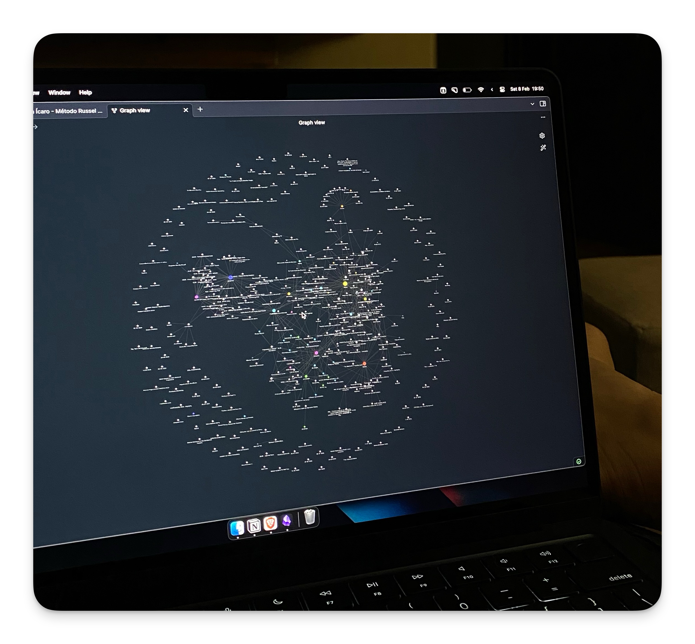

Por meses eu abri conversa nova com IA e gastei o começo dela explicando sempre a mesma coisa. Quem eu sou, no que estou trabalhando, como gosto que as coisas sejam feitas. Aí a conversa acabava e na seguinte eu explicava tudo de novo.

Isso me irritou bastante antes de eu perceber que já tinha a solução na mão.

Meu [Obsidian](https://obsidian.md) já era onde eu guardava projeto, reunião, reflexão e decisão. Quando comecei a usar IA todo dia de verdade, ele não precisou virar outra coisa. Ele já era exatamente o que faltava.

## O arquivo

Na raiz do vault tem um `CLAUDE.md`. Arquivo comum, em markdown, que a IA lê antes de qualquer coisa.

Dentro dele está o que eu não quero repetir nunca mais. Quem eu sou. Onde trabalho. Como quero que falem comigo. A estrutura das pastas. As regras que eu já cansei de corrigir na mão.

Prompt some quando a conversa acaba. Isso fica.

## A estrutura importa mais do que parece

O vault segue mais ou menos o [PARA](https://fortelabs.com/blog/para/), mas o que faz diferença não é o método, é a regra de onde cada coisa mora:

- Tarefa com prazo vai pro [Things](https://culturedcode.com/things/)
- Bloco de tempo vai pro Apple Calendar
- O quê e o porquê do projeto ficam no Obsidian
- Projeto de código vive no [Linear](https://linear.app)

Cada item mora em um lugar só. Nunca copio entre eles.

Isso parece organização pessoal, e é. Mas o efeito colateral foi que a IA sempre sabe onde procurar. Quando eu peço uma análise da semana, ela sabe que planejamento está na weekly note, execução está no Things e decisão de projeto está na nota do projeto. Não precisa adivinhar.

## O log

Toda vez que algo muda no vault, uma linha entra num `log.md`:

```
2026-08-14 | nota | Blog - miguelmoraes.pro
```

Uma linha, sem cerimônia. É o rastro do que aconteceu, e serve pra reconstruir o que andei fazendo sem ler o vault inteiro.

## O que mudou de verdade

O ganho está em não precisar explicar de novo.

Quando eu abro uma conversa e digo "o cliente pediu ajuste na landing", ela já sabe qual cliente, qual squad, que a stack é [Framer](https://framer.com) e onde está o design system daquele projeto. Começo direto no assunto.

Tem um efeito colateral que eu já tinha sentido [prototipando com IA](/blog/como-eu-crio-sites-com-ia) e que aqui apareceu de novo, maior. Escrever o contexto me obrigou a deixar decisão explícita. Muita coisa que eu achava que sabia sobre como trabalho só existia na minha cabeça de forma vaga, e só apareceu quando precisei escrever a regra.

## Se você for tentar

Não começa montando estrutura. Começa pelo arquivo de contexto, escrevendo quem você é e como quer que trabalhem com você. Isso sozinho já muda a qualidade do que volta.

A estrutura vem depois, e vem do uso. A minha mudou umas cinco vezes esse ano.
